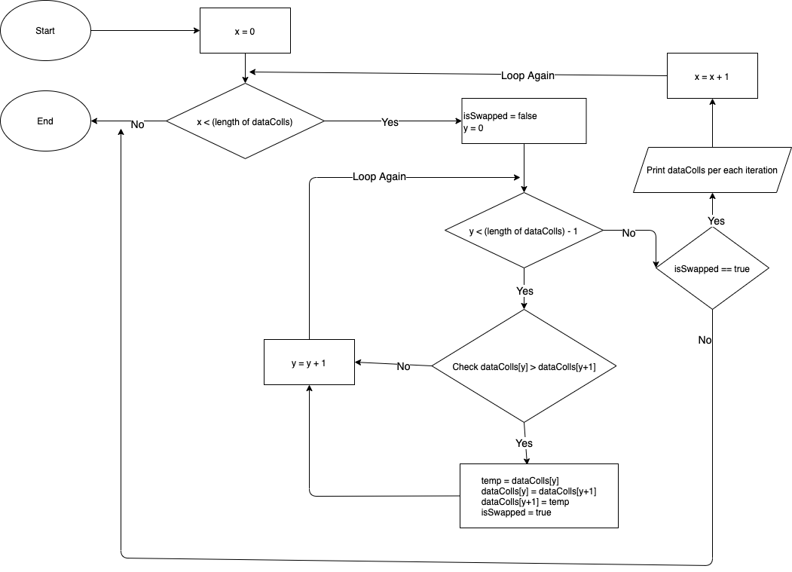

# Sorting Algorithm

## 1. Explanation

This algorithm is the easiest sorting algorithm. The main idea is doing scanning for entire collection data and compare them one by one.

Due to this process this algorithm has the worst performance with `O(n^2)` swaps and comparations. The best performance with `O(n)` comparation and `O(1)` swaps.

<br />

## 2. Pseudocode

```
Function BubbleSort (dataColls)
    Loop x = 0 to (length of dataColls) - 1
        Loop y = 0 to (length of dataColls) - 2
            Check dataColls[y] > dataColls[y + 1] then
                Set temp = dataColls[y]
                Set dataColls[y] = dataColls[y + 1]
                Set dataColls[y + 1] = temp
            End Check
        End Loop

        print latest value of dataColls for each iteration
    End Loop
End Function
```

## 3. Flowchart


## 4. Simulation

Given 3 integers data collections [10, 4, 9, 3, 5], the process would be:

Iteration 1 of X:

- Iteration 1 of Y: Compare 10 > 4 **Yes** then swap [**4**, **10**, 9, 3, 5]
- Iteration 2 of Y: Compare 10 > 9 **Yes** then swap [4, **9**, **10**, 3, 5]
- Iteration 3 of Y: Compare 10 > 3 **Yes** then swap [4, 9, **3**, **10**, 5]
- Iteration 4 of Y: Compare 10 > 5 **Yes** then swap [4, 9, 3, **5**, **10**]

Iteration 2 of X:

- Iteration 1 of Y: Compare 4 > 9 **No** then no swap [4, 9, 3, 5, 10]
- Iteration 2 of Y: Compare 9 > 3 **Yes** then swap [4, **3**, **9**, 5, 10]
- Iteration 3 of Y: Compare 9 > 5 **Yes** then swap [4, 3, **5**, **9**, 10]
- Iteration 4 of Y: Compare 9 > 10 **Yes** then no swap [4, 3, 5, 9, 10]

Iteration 3 of X:

- Iteration 1 of Y: Compare 4 > 3 **No** then swap [**3**, **4**, 5, 9, 10]
- Iteration 2 of Y: Compare 4 > 5 **No** then no swap [3, 4, 5, 9, 10]
- Iteration 3 of Y: Compare 5 > 9 **No** then no swap [3, 4, 5, 9, 10]
- Iteration 4 of Y: Compare 9 > 10 **No** then no swap [3, 4, 5, 9, 10]

Iteration 4 of X:

- Iteration 1 of Y: Compare 3 > 4 **No** then no swap [3, 4, 5, 9, 10]
- Iteration 2 of Y: Compare 4 > 5 **No** then no swap [3, 4, 5, 9, 10]
- Iteration 3 of Y: Compare 5 > 9 **No** then no swap [3, 4, 5, 9, 10]
- Iteration 4 of Y: Compare 9 > 10 **No** then no swap [3, 4, 5, 9, 10]

Iteration 5 of X:

- Iteration 1 of Y: Compare 3 > 4 **No** then no swap [3, 4, 5, 9, 10]
- Iteration 2 of Y: Compare 4 > 5 **No** then no swap [3, 4, 5, 9, 10]
- Iteration 3 of Y: Compare 5 > 9 **No** then no swap [3, 4, 5, 9, 10]
- Iteration 4 of Y: Compare 9 > 10 **No** then no swap [3, 4, 5, 9, 10]

<br />

## Alternative Improvement

As you can see from simulation above, if all collection already sorted before end of the whole loops, it wont stop untill loop is finished. We can improve little bit the performance **by adding some checking on the loop of X, if no swap needed** then we can **exit the loop**. However in some cases even with this additional logic, the sorting will still running until the end of loop to sort entire data. Below is the Pseudocode and Flowchart of the improvement:

### Pseudocode Improvement

```
Function BubbleSort (dataColls)
    Loop x = 0 to (length of dataColls) - 1
        Set isSwapped = false
        Loop y = 0 to (length of dataColls) - 2
            Check dataColls[y] > dataColls[y + 1] then
                Set temp = dataColls[y]
                Set dataColls[y] = dataColls[y + 1]
                Set dataColls[y + 1] = temp
                Set isSwapped = true
            End Check
        End Loop

        if isSwapped is false then
            exit loop

        print latest value of dataColls for each iteration
    End Loop
End Function
```

### Flowchart Improvement



<br />

# License

MIT
