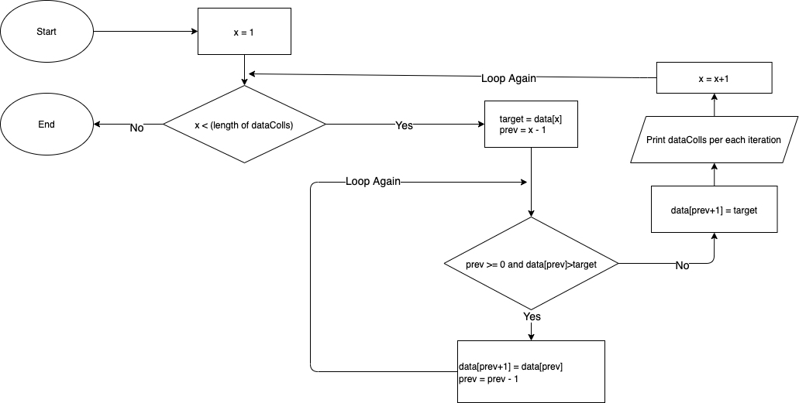

# Sorting Algorithm

## 1. Explanation

The main idea of this algorithm is iterating whole data starting from index no 1 to n (total of data collection), then each iteration we try to pick data from current index as target of comparation then compare with the previous indexes. If the condition is correct then we swap the data.

Due to this process this algorithm has the worst performance with `O(n^2)` swaps and comparations. The best performance with `O(n)` comparation and `O(1)` swaps.

<br />

## 2. Pseudocode

```
Function InsertionSort (dataColls)
    Loop x = 1 to (length of dataColls) - 1 increment by 1
        Set target = data[x]
        Set prev = x - 1

        While prev>=0 and dataColls[prev]>target then
            Set dataColls[prev+1] = dataColls[prev]
            Set prev = prev - 1
        End While

        Set dataColls[prev+1] = target

        print latest value of dataColls for each iteration
    End Loop
End Function
```

## 3. Flowchart



## 4. Simulation

Given 5 integers data collections [10, 4, 9, 3, 5], the process would be:

Iteration index 1 of X:

- Set Target = 4
- Set Prev = 0
- While Index 0 >= 0 and Value 10 > 4
  - Set Value of Index 1 to be => [10, **10**, 9, 3, 5]
  - Set Prev = -1
- Set Value of Index 0 to be => [**4**, 10, 9, 3, 5]

Iteration index 2 of X:

- Set Target = 9
- Set Prev = 1
- While Index 1 >= 0 and Value 10 > 9
  - Set Value of Index 2 to be => [4, 10, **10**, 3, 5]
  - Set Prev = 0
- While Index 0 >= 0 and Value 4 > 9
- Set Value of Index 1 to be => [4, **9**, 10, 3, 5]

Iteration index 3 of X:

- Set Target = 3
- Set Prev = 2
- While Index 2 >= 0 and Value 10 > 3
  - Set Value of Index 3 to be => [4, 9, 10, **10**, 5]
  - Set Prev = 1
- While Index 1 >= 0 and Value 9 > 3
  - Set Value of Index 2 to be => [4, 9, **9**, 10, 5]
  - Set Prev = 0
- While Index0 >= 0 and Value 4 > 3
  - Set Value of Index 1 to be => [4, **4**, 9, 10, 5]
  - Set Prev = -1
- Set Value of Index 0 to be => [**3**, 4, 9, 10, 5]

Iteration index 4 of X:

- Set Target = 5
- Set Prev = 3
- While Index 3 >= 0 and Value 10 > 5
  - Set Value of Index 4 to be => [3, 4, 9, 10, **10**]
  - Set Prev = 2
- While Index 2 >= 0 and Value 9 > 5
  - Set Value of Index 3 to be => [3, 4, 9, **9**, 10]
  - Set Prev = 1
- While Index 1 >= 0 and Value 4 > 5
- Set Value of Index 2 to be => [3, 4, **5**, 9, 10]

<br />

# License

MIT
