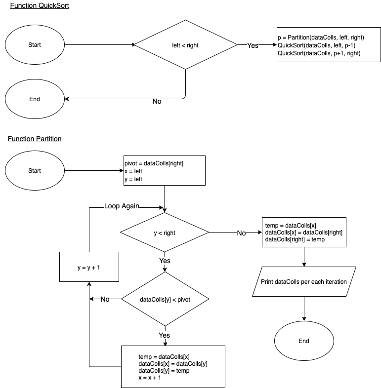

# Sorting Algorithm

## 1. Explanation

QuickSort is a Divide and Conquer algorithm. The main idea of this algorithm is scanning data by using recursive way to sort data by using pivot. By comparing the current index data per each iteration with the pivot we could get the lower data and swap it until end of loop.

Due to this process this algorithm has the worst performance with `O(n^2)` swaps and comparations. The best performance with `O(n log n)` comparation and swaps.

<br />

## 2. Pseudocode

```
Function QuickSort (dataColls, left, right)
    Check left < right then
      Set p = partition(data, left, right)
      Call quickSort(data, left, p-1)
      Call quickSort(data, p+1, right)
    End Check
End Function

Function Partition(dataColls, left, right)
  Set pivot = dataColls[right]
  Set x = left
  Loop y = left to right -1 increment by 1
    Check dataColls[y] < pivot then
      Set temp = dataColls[x]
      Set dataColls[x] = dataColls[y]
      Set dataColls[y] = temp
      Set x = x+1
    End Check
  End Loop

  Set temp = dataColls[x]
  Set dataColls[x] = dataColls[right]
  Set dataColls[right] = temp

  Print Iteration with latest dataColls
  return x
End Function
```

## 3. Flowchart



## 4. Simulation

Given 5 integers data collections [10, 4, 9, 3, 5], the process would be:

Call QuickSort([10, 4, 9, 3, 5], 0, 4)

```
1 => QuickSort:
  if 0 < 4 then
    1.a => p = Partition([10, 4, 9, 3, 5], 0, 4)
    1.b => Call QuickSort([4, 3, 5, 10, 9], 0, 2-1)
    1.c => Call QuickSort([3, 4, 5, 10, 9], 2+1, 4)

1.a => Partition([10, 4, 9, 3, 5], 0, 4)
  pivot = 5
  x = 0

  Loop 0 to 3:
    Iteration 0
      if 10 < 5 `No`
    Iteration 1
      if 4 < 5 `Yes` Then
        temp = 10
        data[0] = 4
        data[1] = 10
        x = 1
        //[4, 10, 9, 3, 5]
    Iteration 2
      if 9 < 5 `No`
    Iteration 3
      if 3 < 5 `Yes`
        temp = 10
        data[1] = 3
        data[3] = 10
        x = 2
        //[4, 3, 9, 10, 5]
  End Loop

  temp = 9
  data[2] = 5
  data[4] = 9
  //Iteration-Left:0-Right:4: [4, 3, 5, 10, 9]
  return 2

1.b => Call QuickSort([4, 3, 5, 10, 9], 0, 2-1)
  if 0 < 1
    1.b.1 => p = Partition([4, 3, 5, 10, 9], 0, 1)
    1.b.2 => Call QuickSort([3, 4, 5, 10, 9], 0, 0-1)
    1.b.3 => Call QuickSort([3, 4, 5, 10, 9], 0+1, 2-1)

1.b.1 => p = Partition([4, 3, 5, 10, 9], 0, 1)
  pivot = 3
  x = 0

  Loop 0 to 0:
    Iteration 0
      if 4 < 3 `No`
  End Loop

  temp = 4
  data[0] = 3
  data[1] = 4
  //Iteration-Left:0-Right:1: [3, 4, 5, 10, 9]
  return 0

1.b.2 => Call QuickSort([3, 4, 5, 10, 9], 0, 0-1)
  if 0 < -1 `No`

1.b.3 => Call QuickSort([3, 4, 5, 10, 9], 0+1, 2-1)
  if 1 < 1 `No`

1.c => Call QuickSort([3, 4, 5, 10, 9], 3, 4)
  if 3 < 4
    1.c.1 => p = Partition(3, 4, 5, 10, 9], 3, 4)
    1.c.2 => Call QuickSort([3, 4, 5, 9, 10], 3, 3-1)
    1.c.3 => Call QuickSort([3, 4, 5, 9, 10], 3+1, 4)

1.c.1 => p = Partition([3, 4, 5, 10, 9], 3, 4)
  pivot = 9
  x = 3

  Loop 3 to 3:
    Iteration 3
      if 10 < 9 `No`
  End Loop

  temp = 10
  data[3] = 9
  data[4] = 10
  //Iteration-Left:3-Right:4: [3, 4, 5, 9, 10]
  return 3

1.c.2 => Call QuickSort([3, 4, 5, 9, 10], 3, 2)
  if 3 < 2 `No`

1.c.3 => Call QuickSort([3, 4, 5, 9, 10], 4, 4)
  if 4 < 4 `No`


```

<br />

# License

MIT
