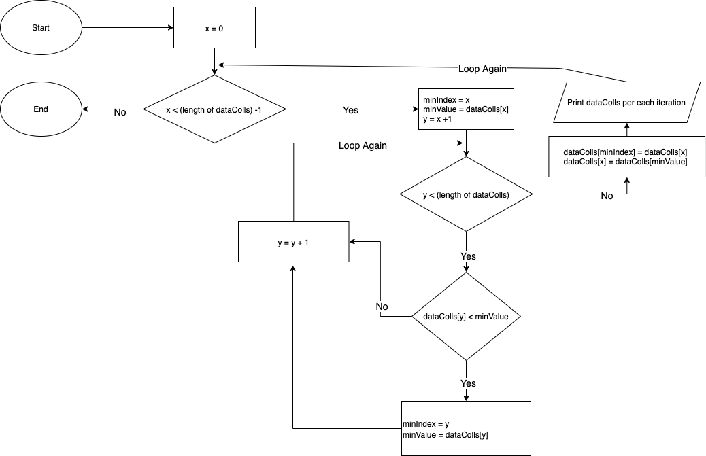

# Sorting Algorithm

## 1. Explanation

The main idea of this algorithm is iterating whole data by finding minimum data per each iteration and swap them at the end of the loop. By doing this, we could get the highest data at the Right Side and the lowest at the Left Side.

Due to this process this algorithm has the worst performance with `O(n^2)` comparation and `O(n)` swaps. The best performance with `O(n^2)` comparation and `O(1)` swaps.

<br />

## 2. Pseudocode

```
Function SelectionSort (dataColls)
    Loop x = 0 to (length of dataColls) - 2 increment by 1
        Set minIndex = x
        Set minValue = data[minIndex]

        Loop y = x+1 to (length of dataColls) -1 increment by 1
            Check data[y] < minValue then
              minIndex = y
              minValue = data[y]
            End Check
        End For

        data[minIndex] = data[x]
        data[x] = minValue

        print latest value of dataColls for each iteration
    End Loop
End Function
```

## 3. Flowchart



## 4. Simulation

Given 5 integers data collections [10, 4, 9, 3, 5], the process would be:

Iteration index 0 of X:

- Set MinIndex = 0
- Set MinValue = 10
- Second Loop starting from index 1:
  - Iteration index 1 of Y
    - Check value 4 < 10 => `YES` then
      - Set MinIndex = 1
      - Set MinValue = 4
  - Iteration index 2 of Y
    - Check value 9 < 4 => `NO` then no update
  - Iteration index 3 of Y
    - Check value 3 < 4 => `YES` then
      - Set MinIndex = 3
      - Set MinValue = 3
  - Iteration index 4 of Y
    - Check value 5 < 3 => `NO` then no update
- Set data MinIndex with data of X index and data of X index with MinValue : [3,4,9,10,5]

Iteration index 1 of X:

- Set MinIndex = 1
- Set MinValue = 4
- Second Loop starting from index 2:
  - Iteration index 2 of Y
    - Check value 9 < 4 => `NO` then no update
  - Iteration index 3 of Y
    - Check value 10 < 4 => `NO` then no update
  - Iteration index 4 of Y
    - Check value 5 < 4 => `NO` then no update
- Set data MinIndex with data of X index and data of X index with MinValue : [3,4,9,10,5]

Iteration index 2 of X:

- Set MinIndex = 2
- Set MinValue = 9
- Second Loop starting from index 3:
  - Iteration index 3 of Y
    - Check value 10 < 9 => `NO` then no update
  - Iteration index 4 of Y
    - Check value 5 < 9 => `YES` then
      - Set MinIndex = 4
      - Set MinValue = 5
- Set data MinIndex with X and data X with MinValue : [3,4,5,10,9]

Iteration index 3 of X:

- Set MinIndex = 3
- Set MinValue = 10
- Second Loop starting from index 4:
  - Iteration index 4 of Y
    - Check value 9 < 10 => `YES` then
      - Set MinIndex = 4
      - Set MinValue = 9
- Set data MinIndex with data of X index and data of X index with MinValue : [3,4,5,9,10]

<br />

# License

MIT
